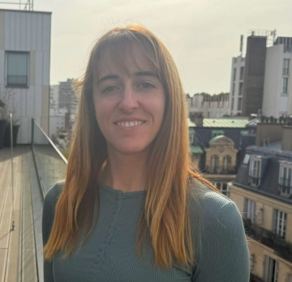

Since October 2025, I am a Senior AI Fellow at [PSL University](https://psl.eu/en) (Paris Sciences & Lettres) and [Paris-Dauphine](https://dauphine.psl.eu/), [Lamsade](https://www.lamsade.dauphine.fr/), where I conduct research in Natural Language Processing (NLP) and I teach. I am also affiliated with the [ALMAnaCH](https://almanach.inria.fr/index-fr.html) team at INRIA Paris.

My broad research area is Natural Language Processing (NLP), and more concretely I am focused on Computational Lexical Semantics, or how we can deal with words and their meaning computationally. I am interested in multiple aspects of meaning: (contextual) word meaning representation, paraphrasing, lexical style and connotation, semantic ambiguity, (near-)synonymy, tokenization and lexical semantic change, among others. In my most recent research, I investigate the dynamics of word meaning in dialog: how speakers understand, negotiate and adapt their word usage in interaction.

I am open to collaborations and welcome potential interns in my areas of research, as well as in related domains (NLP for mental health, low-resource languages, linguistic framing, and others: feel free to [contact me](https://ainagari.github.io/menu/contact.html).)

 
 

### News

* **Oct 2025**: Joined PSL University as a Senior AI Fellow!
* **Sep 2025**: Papers accepted at Findings of EMNLP and *SEM: See you in Suzhou in November!
* **Oct 2024**: Joined INRIA's [ALMAnaCH](https://almanach.inria.fr/index-fr.html) team as a postdoctoral researcher.
* **May 2024**: Attended LREC-COLING and gave a talk at the CS department of the University of Turin.
* **Jan 2024**: Our paper on the semantic quality of split-word representations has been accepted to **TACL**!
* **Jul 2023**: Our SICon paper on lexico-semantic alignment received the **Outstanding Paper Award**!
* **Aug 2022**: One paper accepted at **COLING 2022**! 
* **Jul 2022**: Gave a talk at the Jozef Stefan Institute in Ljubjana, Slovenia.
* **Apr 2022**: Our paper on polysemy in conversation and written texts has been accepted to **LREC 2022**!
* **Sep 2021**: I started working as a postdoctoral researcher at Télécom Paris.
* **Jun 24, 2021**: I defended my PhD thesis! You can find it [here](https://tel.archives-ouvertes.fr/tel-03341706/document).
* **Apr 2021**: Our latest work has been accepted at **NAACL 2021** and **TACL**! 
* **Sep 2020**: Our paper on scalar adjective ranking with BERT has been accepted at **EMNLP 2020**!
* **May 2020**: Participated in [SemEval 2020 task 3: Graded Word Similarity in Context](https://competitions.codalab.org/competitions/20905).
* **Feb 2020**: Gave a talk at the [Research Seminar Language Technology](https://blogs.helsinki.fi/language-technology/research-seminar/) of the Department of Digital Humanities, University of Helsinki.
