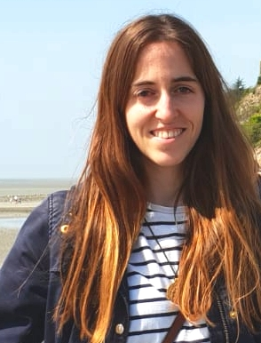

I'm a third-year PhD student at the TLP group of the LIMSI lab, in Orsay, France, under the supervision of Marianna Apidianaki and Alexandre Allauzen. My thesis is part of the ANR [MultiSem](https://sites.google.com/view/multisem/home) project.

My broad research area is Natural Language Processing, and more concretely I am working on Computational Lexical Semantics with a focus on the adaptation of linguistic representations to semantic properties of words.

I'm particularly interested in representations of words and meaning in context, but my general research interests also include paraphrasing, lexical style and semantic ambiguity.

### News

* **Feb 2019**: Giving a talk at the [Research Seminar Language Technology](https://blogs.helsinki.fi/language-technology/research-seminar/) of the Department of Digital Humanities, University of Helsinki.
* **Dec 2019**: After a very long wait, the work done during my collaboration with the [Grammar & Cognition Lab](http://grammar.cat/) (Universitat de Barcelona & Universitat Pompeu Fabra) has been accepted in the journals *Glossa* and *Communication Disorders*.
* **Jul 2019**: Attended [ACL](http://www.acl2019.org/EN/index.xhtml) in Florence, Italy.
* **Jun 2019**: Attended [*SEM](https://starsem.org/2019/) in Minneapolis, MN, co-located with NAACL, to present our work on Usage Similarity Estimation.
* **May 2019**: Participated in the [SemDeep-5 WiC Challenge](http://www.dfki.de/~declerck/semdeep-5/challenge.html).
* **May 2019**: Attended [IWCS](https://sites.google.com/view/iwcs2019/home) in Gothemburg, Sweden, to present our work on Lexical Substitution.
